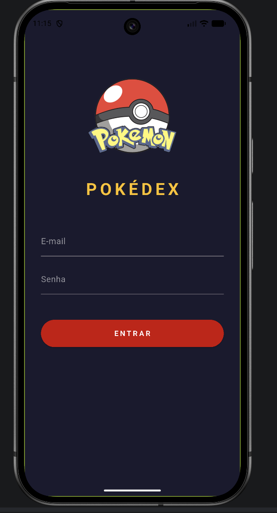
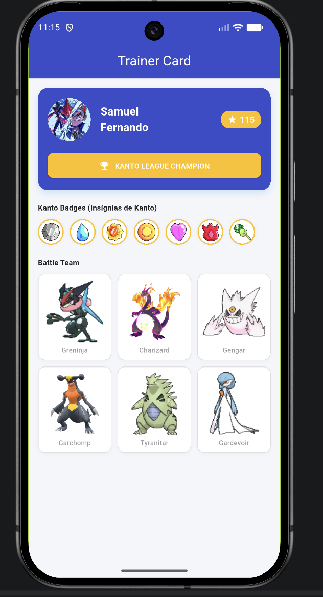
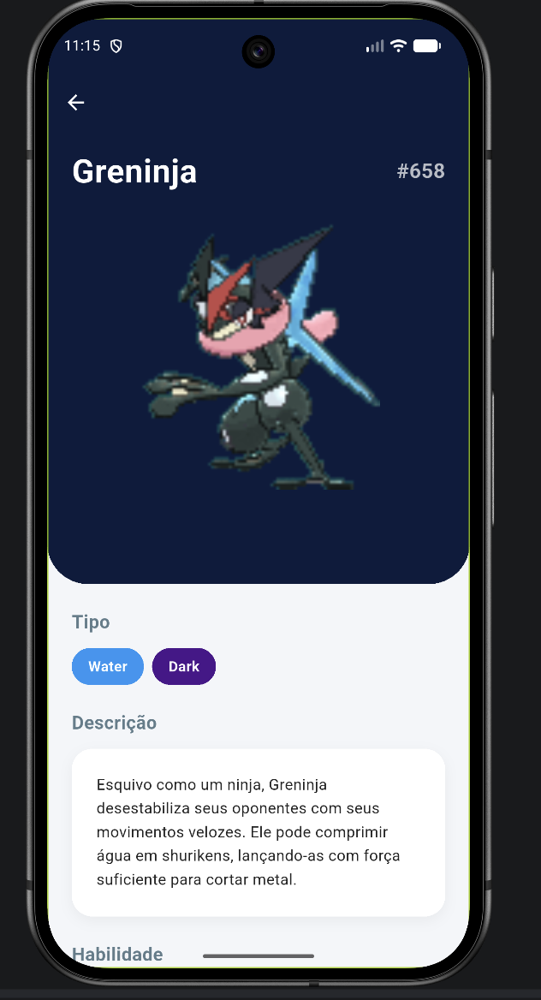
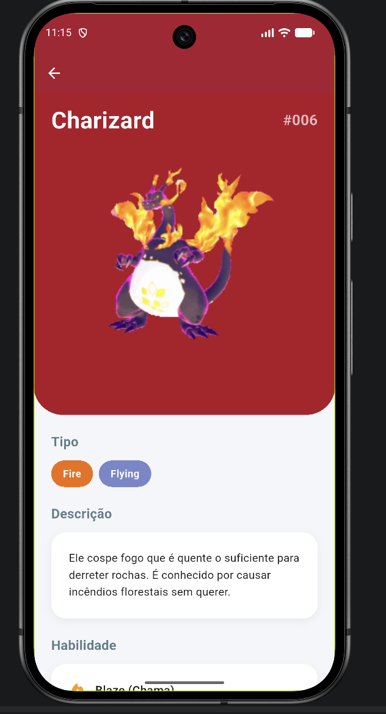
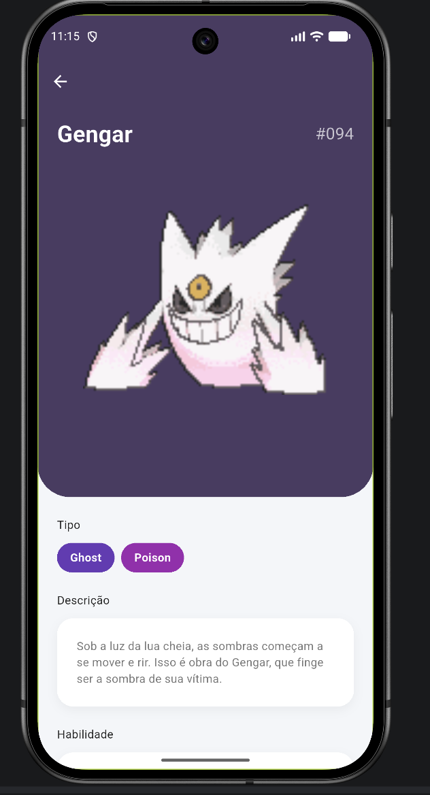
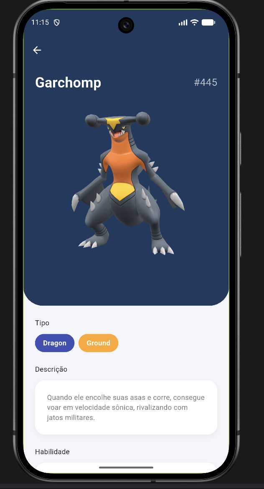
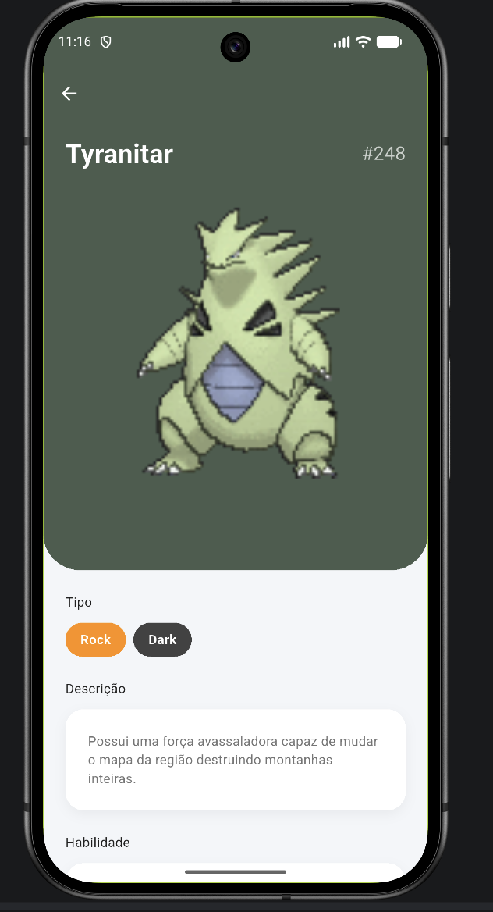
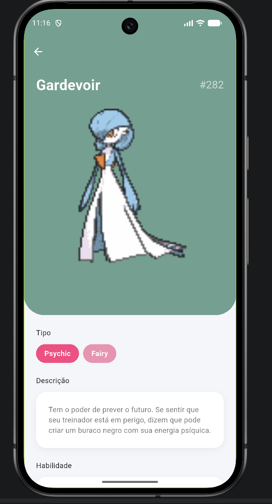

# ⚡ Pokédex Mobile & Trainer Card | Primeiro Projeto em Flutter 🎮

Uma aplicação mobile moderna e interativa inspirada na franquia Pokémon, desenvolvida como projeto prático para consolidar fundamentos de **Flutter** e **Dart**!

O app simula a experiência de um **Cartão de Treinador (Trainer Card)** digital, integrando perfil personalizado, coleção de insígnias de ginásio com rolagem horizontal e um time de batalha com suporte a GIFs animados e navegação individual para cada Pokémon.

---

## 📸 Capturas de Tela

<p align="center">
  
  
  
  
</p>

<p align="center">
  
  
  
  
</p>

---

## 🚀 Recursos & Funcionalidades

### 🆔 1. Perfil do Treinador (Trainer Card)
- **Painel Personalizado:** Exibição da foto de perfil do treinador (*Samuel Fernando*), ID único e indicador de pontos/conquistas.
- **Selo de Título:** Destaque visual customizado para o status de *Kanto League Champion* com ícone de troféu.

### 🏅 2. Galeria Interativa de Insígnias
- Carrossel horizontal intuitivo (`SingleChildScrollView`) apresentando a coleção completa de **Insígnias da Região de Kanto**:
  - Insígnia da Rocha (*Boulder Badge*)
  - Insígnia da Cascata (*Cascade Badge*)
  - Insígnia do Trovão (*Thunder Badge*)
  - Insígnia do Lama / Alma (*Rainbow & Soul Badges*)
  - Insígnia do Vulcão (*Volcano Badge*)
  - Insígnia da Terra (*Earth Badge*)
- **Destaque Visual:** Bordas douradas estilizadas em cada insígnia.

### ⚔️ 3. Esquadrão de Batalha (Battle Team)
- Grid responsiva (`GridView.builder`) apresentando a equipe principal composta por:
  - **Greninja** 🥷
  - **Charizard** 🔥
  - **Gengar** 👻
  - **Garchomp** 🐉
  - **Tyranitar** 🪨
  - **Gardevoir** 🔮
- **Navegação Dinâmica:** Toque em qualquer membro da equipe para transicionar diretamente para a sua respectiva tela detalhada (`charizard_page.dart`, `garchomp_page.dart`, etc.).

---

## 🛠️ Tecnologias Utilizadas

- **Framework:** [Flutter](https://flutter.dev/) (3.x)
- **Linguagem:** [Dart](https://dart.dev/)
- **UI & Componentes:** `GridView`, `SingleChildScrollView`, `InkWell`, `ElevatedButton`, `BoxDecoration`.
- **Gerenciamento de Assets:** Renderização de arquivos PNG estáticos e GIFs animados para dinamismo visual.

---

## 📂 Estrutura do Projeto

O código foi organizado seguindo princípios de modularidade e separação de responsabilidades para manter uma arquitetura limpa e escalável:

```text
pokedex_mobile/
├── assets/
│   └── images/                 # Mídias do app (GIFs dos Pokémon, avatares e insígnias)
├── lib/
│   ├── main.dart               # Ponto de inicialização do app
│   ├── pages/                  # Views / Telas da aplicação
│   │   ├── home_page.dart
│   │   ├── login_page.dart
│   │   ├── treinador_page.dart
│   │   ├── charizard_page.dart
│   │   ├── garchomp_page.dart
│   │   ├── gardevoir_page.dart
│   │   ├── gengar_page.dart
│   │   └── tyranitar_page.dart
│   └── styles/                 # Estilos, temas e cores centralizadas
│       ├── home_style.dart
│       ├── login_style.dart
│       └── treinador_style.dart
